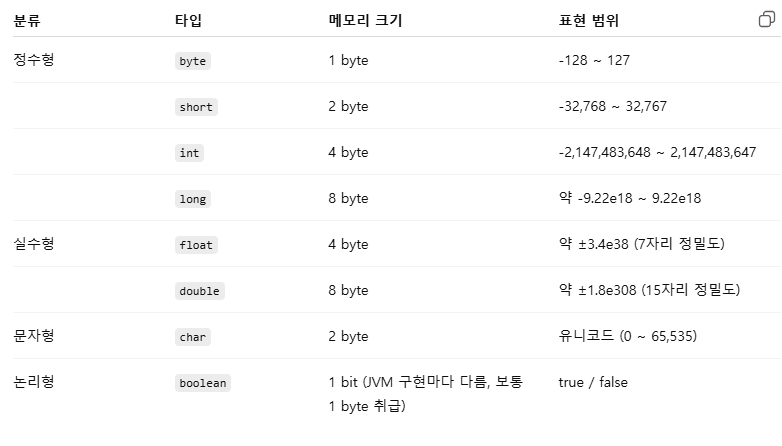
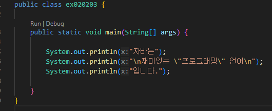
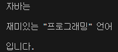
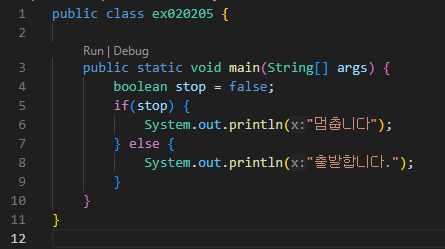
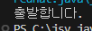

# 혼공자 확인 문제

## [용어정리](https://github.com/jinseonyeong087-ship-it/java-study/blob/main/Terminology.md)

## 01-01-01

- 소스파일은 사람이 읽을 수 있는 프로그래밍 언어로 작성된 파일. 컴파일러가 해석해야하는 텍스트
- 자바 언어로 프로그램을 개발하기 위해서는 JDK(Java Development Kit)를 설치
- JDK가 설치되면 기본적으로 C:\Program Files\Java 폴더가 생성 (Windows에서 기본 설치 경로는 C:\Program Files\Java\jdk버전)
- 자바 컴파일러와 실행 명령어는 JDK 설치폴더 \bin 폴더에 있다.

## 01-01-02
- 다른 경로에서 bin 폴더 안에 있는 명령어를 사용할 수 있도록 하기 위해 JDK 설치 폴더 안의 bin 폴더를 Path 환경 변수에 등록해야 한다.

## 01-02-01
- 이클립스는 무료이며, 통합 개발 환경(IDE)을 제공한다.
- 이클립스를 실행할 때에는 워크스페이스를 지정해야 한다.
- 퍼스펙티브는 뷰들을 미리 묶어 이름을 붙여 놓은 것이다.

## 01-03-01
- 자바 프로그램 개발 과정 순서
1. 소스파일(~.java)을 작성
2. javac 명령어로 컴파일
3. java 명령어로 실행
4. 실행결과 확인

## 01-03-02
- 자바 소스는?
  - 컴파일하면 '클래스이름.class'라는 바이트 코드 파일이 생성
  - main() 메소드는 반드시 클래스 블록 내부에서 작성
  - 컴파일 후 실행을 하려면 반드시 main() 메소드가 있어야 한다.

## 01-03-03
- 주석?
  - //뒤의 라인 내용은 모두 주석이 된다.
  - /*부터 시작해서 */까지 모든 내용이 주석이 된다.
  - 문자열 안에는 주석을 만들 수 없다.

## 01-03-04
- 이클립스의 자바 프로젝트?
  - 기본적으로 소스 파일과 바이트 코드 파일이 저장되는 폴더가 다르다.
  - 자바 소스 파일을 작성하는 폴더는 src이다.
  - 올바르게 작성된 소스 파일을 저장하면 자동으로 컴파일되고, 바이트 코드 파일이 생성된다.

## 01-03-05
- 이클립스에서 바이트 코드 파일을 실행하는 방법?
  - Package Explorer 뷰에서 소스 파일을 선택하고, 툴 바에서 Run 아이콘을 클릭
  - Package Explorer 뷰에서 소스 파일을 선택하고, 마우스 오른쪽 버튼을 클릭한 후 [Run As] - [Java Application]을 선택

## 02-01-01
- 변수?
  - 변수는 하나의 값만 저장
  - 변수는 선언 시에 사용한 타입의 값만 저장
  - 변수는 변수가 선언된 중괄호 {} 안에서만 사용 가능

## 02-01-02
- 변수 이름 가능 : 첫 글자가 문자, $, _ (첫 글자가 문자더라도 예약어는 사용 불가 - class, public, static, void, int 등)

## 02-01-03
- [컴파일 에러 찾기](https://github.com/jinseonyeong087-ship-it/java-study/blob/main/src/java/example/ex020103.java)  
int sum;  
int score = 0;  
int score2;  
sum = score1 + score2; ----->error : 위에서 score2에 대한 결과값(초기화)를 하지 않아 컴파일 에러 발생

## 02-01-04
- [컴파일 에러 찾기](https://github.com/jinseonyeong087-ship-it/java-study/blob/main/src/java/example/ex020104.java)    
int v1 = 0;  
if (true) {  
  int v2 = 0;  
  if (true) {  
    int v3 = 0;  
    v1 = 1;  
    v2 = 1;  
    v3 = 1;  
  }  
  v1 = v2 + v3;     ------->error : 지역 변수 v3는 안쪽 if 블록에서만 유효  
}  
System.out.println(v1);

## 02-02-01
- 자바의 기본 타입  

## 02-02-02
- 변수에 값을 저장하는 코드  
  -char var = 65;  
  -double var = 100.0;

## 02-02-03
- 코드 실행 시 콘솔에 출력되는 내용  
  

## 02-02-04
- 컴파일 에러 발생  
double value = 2e-350;   ------->error : 허용범위를 벗어남(double이 허용하는 소수점 이하 자리는 15자리 정도)

## 02-02-05
- 코드 실행 시 콘솔에 출력되는 내용  
  

## 02-03-01
- 기본 타입 자동 변환 허용 범위 (크기 순서)
  - byte (1바이트, -128 ~ 127)
  - short (2바이트, -32,768 ~ 32,767)
  - char (2바이트, 0 ~ 65,535, 부호 없음)
  - int (4바이트, 약 -21억 ~ 21억)
  - long (8바이트, 매우 큰 정수 범위)
  - float (4바이트, 부동소수점, 정밀도 약 7자리)
  - double (8바이트, 부동소수점, 정밀도 약 15자리)

- 변환 가능 경로  
byte → short, char → int → long → float → double  

**주의**   
char와 short는 크기(2바이트)는 같지만 표현 방식이 달라서 바로 변환 불가. char → int → long → float → double로는 자동 변환이 가능

## 02-03-02
- 강제 타입 변환

- String 은 기본 타입(primitive type) 이 아니고, 참조 타입(reference type, 클래스).자동/강제 변환이 안 됨. valueOf(), parseXXX() 같은 메소드로 변환