# 혼공자 확인 문제 5~8

## [용어정리 2](https://github.com/jinseonyeong087-ship-it/java-study/blob/main/Terminology2.md)  


## 05-01-01
- 참조 타입
  - 객체의 주소값을 저장할 수 있는 타입  
  - 클래스, 인터페이스, 배열 타입이 있다. (기본 타입 int, double, boolean 등은 값 자체를 저장하는 기본 타입)

## 05-01-02
- JVM 메모리 구조 개요
  - 메서드 영역 (Method Area / MetaSpace) : 클래스의 바이트코드, static 변수, 상수, 메서드 정보가 여기에 저장
  - 힙 영역 (Heap) : new 키워드로 만든 객체와 배열 저장
  - 스택 영역 (Stack) : 지역변수, 매개변수 저장
  - PC 레지스터 & 네이티브 메서드 스택

## 05-01-03
- String 타입
  - 문자열(문자들의 연속)을 표현하는 클래스
  - 참조타입 (new로 객체를 만들거나 문자열 리터럴을 참조)
  - java.lang.String 클래스에 속해 있어서 import 없이 사용 가능

## 05-01-04
- 참조 변수
  - 객체의 주소값(참조)을 저장하는 변수 (참조변수는 힙(Heap)에 있는 객체의 위치(주소)를 저장)
  - 같은 참조변수를 복사하면 같은 객체를 가리킴
  - null로 초기화할 수 있음 (아무 객체도 참조하지 않음)

## 05-01-05
- [코드실행](https://github.com/jinseonyeong087-ship-it/java-study/blob/main/src/java/example/ex050105.java)  
  
실행 결과  


## 05-02-01
- 배열 : 같은 타입의 값들을 연속된 공간에 저장. 각각의 값은 인덱스(index) 로 접근할 수 있고, 인덱스는 0부터 시작
- 배열 생성 방법
  - 길이만 지정해서 만들기  
    ```int[] arr = new int[3];             // int의 기본값은 0 → [0, 0, 0]  ```
    

  - 생성과 동시에 값 넣기  
    ```
    int[] arr = new int[] {10, 20, 30};  // new + 초기화  
    int[] arr2 = {10, 20, 30};           // new 생략 가능  
    ```

  - 나중에 할당 
    ``` 
    int[] arr;  
    arr = new int[5];  // 5칸짜리 배열 나중에 생성
    ```

  - 값 접근 & 변경  
    ```
    arr[0] = 100;                 // 첫 번째 요소에 100 저장  
    System.out.println(arr[0]);   // 첫 번째 요소 출력  
    ```

  - 배열 순회 (for문, 향상된 for문)  
    ```
    for (int i = 0; i < arr.length; i++) {  
    System.out.println("arr[" + i + "] = " + arr[i]);  
    }  
    // 향상된 for문 (for-each)  
     for (int value : arr) {  
    System.out.println(value);  
    }   
    ```

  - 다차원 배열 생성  
    ```
    // 2행 3열 배열  
    int[][] matrix = new int[2][3];  
    int[][] matrix2 = {  
    {1, 2, 3},  
    {4, 5, 6}  
    };  
    System.out.println(matrix2[1][2]); // 6
    ```

## 05-02-02
- 배열의 기본 초기값 : 자바가 자동으로 기본값을 채워준다.  


## 05-02-03
- [코드실행](https://github.com/jinseonyeong087-ship-it/java-study/blob/main/src/java/example/ex050203.java)  


## 05-02-04
- [코드작성](https://github.com/jinseonyeong087-ship-it/java-study/blob/main/src/java/example/ex050204.java)  


## 05-02-05
- [코드작성](https://github.com/jinseonyeong087-ship-it/java-study/blob/main/src/java/example/ex050205.java)  
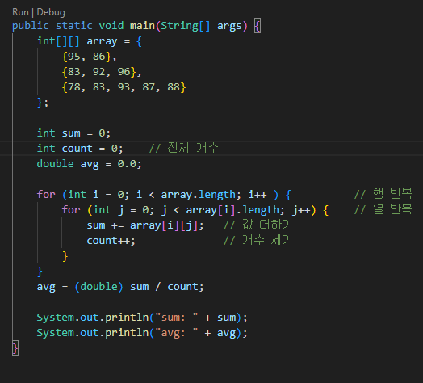  

## 05-02-06
- [코드작성](https://github.com/jinseonyeong087-ship-it/java-study/blob/main/src/java/example/ex050206.java)  
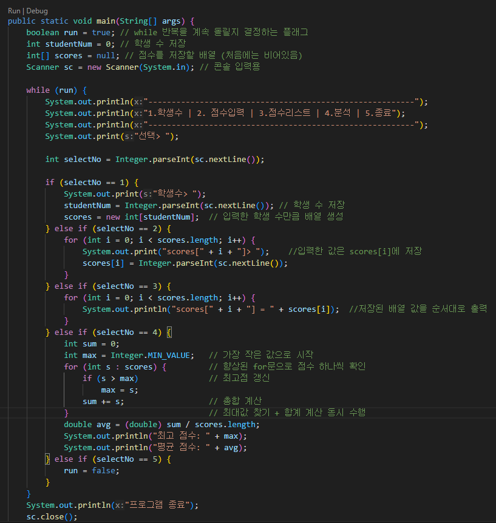

## 05-03-01
- 열거 타입(enum)
  - 서로 관련 있는 상수들을 하나의 타입으로 묶어서 정의할 수 있는 특별한 클래스
  - enum 키워드로 선언
  - 값이 고정되어 있는 경우 (요일, 방향, 상태 등)에 많이 사용
  - 가독성: 의미 있는 이름으로 상수를 관리
  - 타입 안전성: 잘못된 값 방지
  - 유지보수 용이: 값 추가/변경 시 코드 일관성 유지
  - 추가 기능 확장: 메서드, 생성자, 필드 등으로 다양한 로직 내장 가능  
  - ex
  ```
  enum Day {
    MONDAY, TUESDAY, WEDNESDAY, THURSDAY, FRIDAY, SATURDAY, SUNDAY
   }
  ```

- 열거 상수
  - 열거 상수 = enum 안의 각각의 값
  - 자동으로 객체로 생성되며, public static final 형태라 변경 불가
  - == 사용 가능 (참조 비교 OK → 같은 객체이므로)
  - name(), ordinal(), values() 같은 메서드로 다양한 정보 확인 가능

## 05-03-02
- [열거타입](https://github.com/jinseonyeong087-ship-it/java-study/blob/main/src/java/example/ex050302.java)  
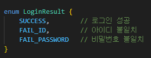  
- 열거 타입(enum) 을 선언하는 이유는 단순히 상수를 모아두기 위해서만이 아니라, 코드를 더 안전하고 읽기 좋게 만들고 유지보수하기 위해서

## 06-01-01,02
- 클래스(Class) : 객체를 만들기 위한 설계도(청사진, 틀)
  ```
  필드(Field) → 객체가 가질 속성 (변수), 객체의 데이터 저장
  메서드(Method) → 객체가 할 수 있는 행동 (함수), 객체의 동작 부분, 실행 코드를 가지고 있는 블록
  생성자(Constructor) → 객체를 초기화하는 역할
  ```

- 객체(Object) : 클래스를 이용해 실제로 만들어낸 실체(Instance)
  ```
  클래스를 기반으로 new 키워드를 사용해 메모리에 생성
  필드에 값을 저장하고, 메서드를 호출해 행동 수행 가능
  ```

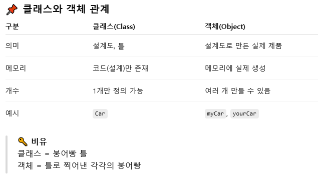

## 06-01-03
- [예시](https://github.com/jinseonyeong087-ship-it/java-study/blob/main/src/java/example/ex060103.java)  
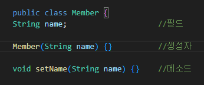

## 06-02-01
- 필드 : 클래스 블록 안에 선언된 변수
  - 클래스 안, 메서드 밖에서 선언
  - 객체의 속성을 나타냄
  - 객체 외부에서도 접근 가능 (public 이라면!)
  - 참조 변수.필드이름으로 접근 (m1.name, m2.age)
  - 자동 초기화 지원
    ```
    숫자형 → 0
    boolean → false
    참조형 → null
    ```

## 06-02-02
- [클래스선언](https://github.com/jinseonyeong087-ship-it/java-study/blob/main/src/java/example/Member.java)   
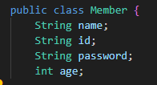

## 06-02-03
- [코드작성](https://github.com/jinseonyeong087-ship-it/java-study/blob/main/src/java/example/ex060203.java)  
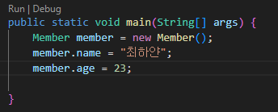

## 06-03-01
- 생성자 : 자바에서 객체를 만들 때 자동으로 호출되는 특별한 메서드
  ```
  다른 생성자를 호출하기 위해 this()를 사용할 수 있다.
  생성자가 선언되지 않으면 컴파일러가 기본 생성자를 추가한다.
  매개 변수의 수, 타입, 순서가 다른 생성자를 여러 개 선언할 수 있다.
  ```

## 06-03-02
- [클래스선언](https://github.com/jinseonyeong087-ship-it/java-study/blob/main/src/java/example/ex060302.java)  
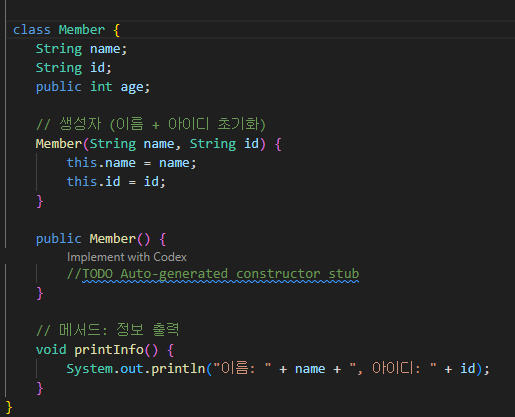

## 06-03-03
- [중복코드제거](https://github.com/jinseonyeong087-ship-it/java-study/blob/main/src/java/example/ex060303.java)  
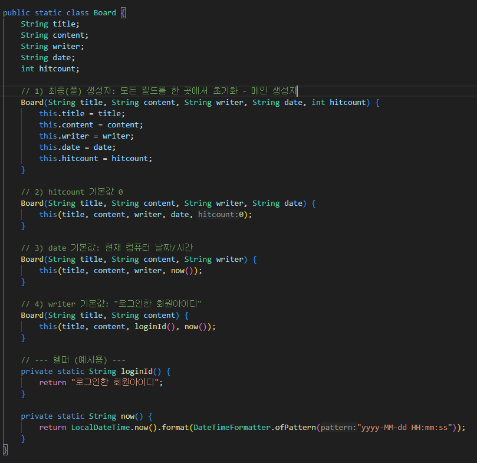

## 06-03-04
- [객체생성](https://github.com/jinseonyeong087-ship-it/java-study/blob/main/src/java/example/ex060303.java)  
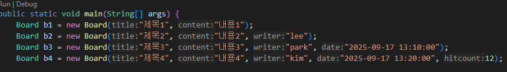

## 06-04-01
- 메소드 : 클래스 안에 정의된 기능(동작)을 수행하는 코드 블록 (객체가 할 수 있는 행동을 정의한 것)  
  ```
  리턴값이 없는 메소드는 리턴 타입을 void로 해야 한다.
  리턴 타입이 있는 메소드는 리턴값을 지정하기 위해 반드시 return문이 있어야 한다.
  매개값의 개수를 모를 경우 ... 을 이용해서 매개 변수를 선언할 수 있다.
  같은 이름의 메소드를 여러 개 선언하는 것을 메소드 오버로딩이라고 한다.
  ```
   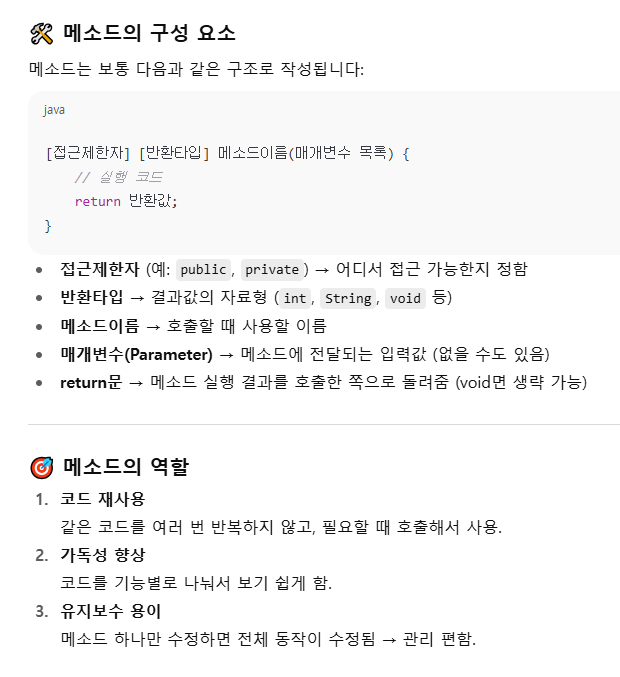

## 06-04-02
- 메소드 오버로딩 : 같은 이름의 메소드를 여러 개 만들되, 매개변수의 개수나 타입을 다르게 해서 구분 (한 기능을 다양한 방식으로 쓸 수 있도록 하는 것)
  ```
  동일한 이름의 메소드를 여러 개 선언하는 것을 말한다.
  매개 변수의 타입, 개수, 순서를 다르게 선언해야 한다.
  매개값의 타입 및 개수에 따라 호출될 메소드가 선택된다.
  리턴타입은 오버로딩 성립 여부에 영향을 주지 않는다.
  ```

## 06-04-03
- [클래스](https://github.com/jinseonyeong087-ship-it/java-study/blob/main/src/java/example/MemberService.java)   
- [출력](https://github.com/jinseonyeong087-ship-it/java-study/blob/main/src/java/example/MemberServiceExample.java)  
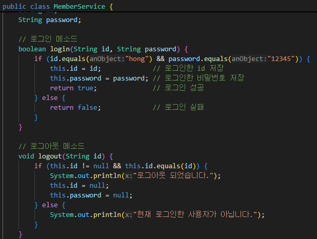

## 06-04-04
- [클래스](https://github.com/jinseonyeong087-ship-it/java-study/blob/main/src/java/example/Printer.java)
- [출력](https://github.com/jinseonyeong087-ship-it/java-study/blob/main/src/java/example/PrinterExample.java)  
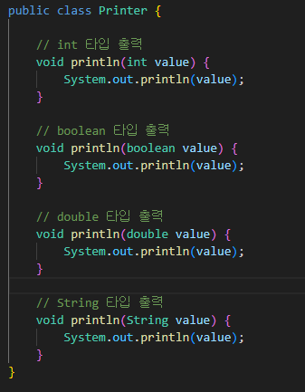  
자바에서는 같은 이름의 메서드를 여러 개 정의할 수 있습니다.  
조건은 매개변수의 타입, 개수, 순서가 달라야 합니다.  
이를 메서드 오버로딩이라고 해요.  

## 06-05-01
```
정적 멤버는 static으로 선언된 필드와 메소드를 말한다.
정적 필드와 메소드는 객체 생성 없이 클래스를 통해 접근할 수 있다.
인스턴스 필드와 메소드는 객체를 생성하고 사용해야 한다.
```

- 인스턴스 멤버 (Instance Member)
  - 객체(인스턴스)가 생성될 때마다 새로 만들어짐
  - 인스턴스 필드와 인스턴스 메소드가 있음
  - 각 객체마다 고유한 값을 가짐

- 정적 멤버 (Static Member)
  - 클래스가 로드될 때 메모리에 1개만 올라감
  - 클래스 필드(정적 필드)와 클래스 메소드(정적 메소드)가 있음
  - 모든 객체가 공유함 → 객체를 생성하지 않아도 접근 가능

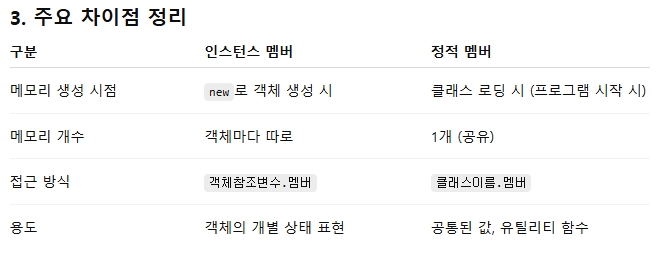

## 06-05-02
```
final 필드와 상수는 초기값이 저장되면 값을 변경할 수 없다.
상수의 이름은 대문자로 작성하는 것이 관례이다.
상수는 객체 생성 없이 클래스를 통해 사용할 수 있다.
```

- final 필드 (Final Field)
  - 객체마다 값이 다를 수 있음 → 인스턴스별로 고정 값
  - 선언 시 바로 초기화하거나, 생성자에서 한 번만 초기화 가능
  - 불변성(immutability)을 보장 → 주로 안전성을 위해 사용

- 상수 (Constant)
  - 모든 객체에서 공유되는 값 (정적 멤버 + 값 변경 불가 (final))
  - static final 조합으로 선언 → 클래스 차원의 고정값

## 06-05-03
- [클래스](https://github.com/jinseonyeong087-ship-it/java-study/blob/main/src/java/example/ShopService.java)  
- [출력](https://github.com/jinseonyeong087-ship-it/java-study/blob/main/src/java/example/MemberService.java)  
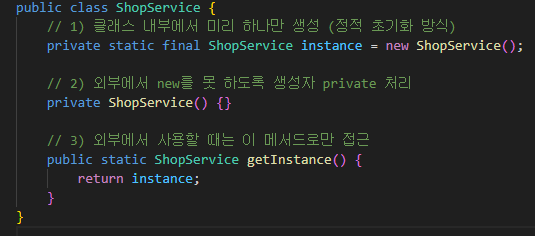  

private static final ShopService instance = new ShopService();
→ 클래스가 로드될 때 딱 한 번 객체 생성 (Eager Initialization)

private ShopService()
→ 외부에서 new ShopService() 금지 (싱글톤 보장)

public static ShopService getInstance()
→ 전역적으로 같은 객체 반환

