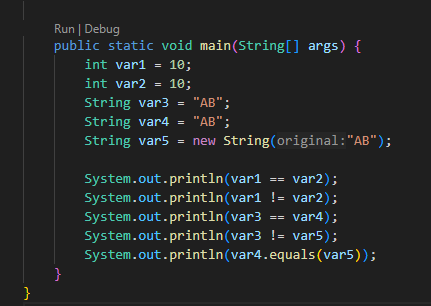
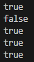
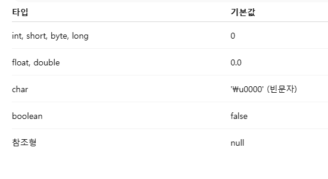
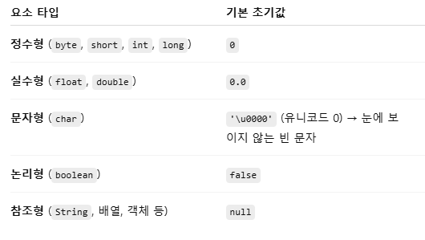
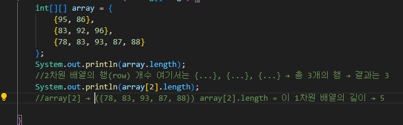
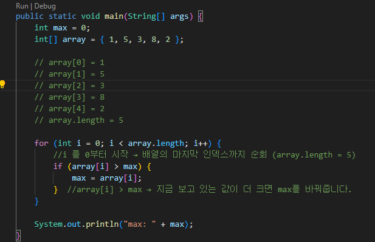

# 혼공자 확인 문제 5~8

## [용어정리 2](https://github.com/jinseonyeong087-ship-it/java-study/blob/main/Terminology2.md)  


## 05-01-01
- 참조 타입
  - 객체의 주소값을 저장할 수 있는 타입  
  - 클래스, 인터페이스, 배열 타입이 있다. (기본 타입 int, double, boolean 등은 값 자체를 저장하는 기본 타입)

## 05-01-02
- JVM 메모리 구조 개요
  - 메서드 영역 (Method Area / MetaSpace) : 클래스의 바이트코드, static 변수, 상수, 메서드 정보가 여기에 저장
  - 힙 영역 (Heap) : new 키워드로 만든 객체와 배열 저장
  - 스택 영역 (Stack) : 지역변수, 매개변수 저장
  - PC 레지스터 & 네이티브 메서드 스택

## 05-01-03
- String 타입
  - 문자열(문자들의 연속)을 표현하는 클래스
  - 참조타입 (new로 객체를 만들거나 문자열 리터럴을 참조)
  - java.lang.String 클래스에 속해 있어서 import 없이 사용 가능

## 05-01-04
- 참조 변수
  - 객체의 주소값(참조)을 저장하는 변수 (참조변수는 힙(Heap)에 있는 객체의 위치(주소)를 저장)
  - 같은 참조변수를 복사하면 같은 객체를 가리킴
  - null로 초기화할 수 있음 (아무 객체도 참조하지 않음)

## 05-01-05
- [코드실행](https://github.com/jinseonyeong087-ship-it/java-study/blob/main/src/java/example/ex050105.java)  
  
실행 결과  


## 05-02-01
- 배열 : 같은 타입의 값들을 연속된 공간에 저장. 각각의 값은 인덱스(index) 로 접근할 수 있고, 인덱스는 0부터 시작
- 배열 생성 방법
  - 길이만 지정해서 만들기  
    ```int[] arr = new int[3];             // int의 기본값은 0 → [0, 0, 0]  ```
    

  - 생성과 동시에 값 넣기  
    ```
    int[] arr = new int[] {10, 20, 30};  // new + 초기화  
    int[] arr2 = {10, 20, 30};           // new 생략 가능  
    ```

  - 나중에 할당 
    ``` 
    int[] arr;  
    arr = new int[5];  // 5칸짜리 배열 나중에 생성
    ```

  - 값 접근 & 변경  
    ```
    arr[0] = 100;                 // 첫 번째 요소에 100 저장  
    System.out.println(arr[0]);   // 첫 번째 요소 출력  
    ```

  - 배열 순회 (for문, 향상된 for문)  
    ```
    for (int i = 0; i < arr.length; i++) {  
    System.out.println("arr[" + i + "] = " + arr[i]);  
    }  
    // 향상된 for문 (for-each)  
     for (int value : arr) {  
    System.out.println(value);  
    }   
    ```

  - 다차원 배열 생성  
    ```
    // 2행 3열 배열  
    int[][] matrix = new int[2][3];  
    int[][] matrix2 = {  
    {1, 2, 3},  
    {4, 5, 6}  
    };  
    System.out.println(matrix2[1][2]); // 6
    ```

## 05-02-02
- 배열의 기본 초기값 : 자바가 자동으로 기본값을 채워준다.  


## 05-02-03
- [코드실행](https://github.com/jinseonyeong087-ship-it/java-study/blob/main/src/java/example/ex050203.java)  


## 05-02-04
- [코드작성]()  

