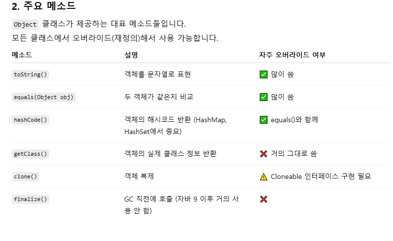

# 혼공자 확인 문제 9~14

## [용어정리 3]()  

## 11-01-01
```
모든 자바 클래스의 최상위 부모 클래스이다.
Object 의 equals() 메소드는 == 연산자와 동일하게 번지를 비교한다.
동등 비교를 위해 equals()와 hashCode() 메소드를 재정의하는 것이 좋다.
```
- Object 클래스
  - 자바에서 모든 클래스는 java.lang.Object를 상속
  - 명시적으로 extends를 안 써도 자동으로 상속
  - 모든 클래스는 Object의 메소드를 사용할 수 있음
  
  
  

## 11-01-02