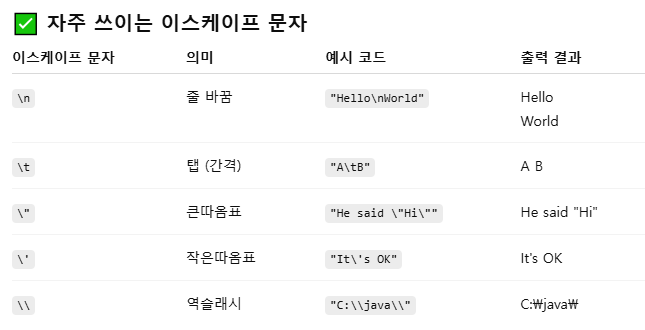

# 용어정리
## javac 
 Java Compiler (자바 컴파일러 - .java 소스 파일을 컴파일해서 .class 바이트코드 파일을 만드는 명령어)

## method
클래스 안에 정의된 동작(기능). 객체가 할 수 있는 “동사(행동)”를 코드로 작성

## Path 환경 변수
운영체제(OS) 가 프로그램 실행 파일을 찾는 검색 경로

## 예약어
Java 언어에서 이미 특정 의미/용도로 정해진 단어 (class, public, static, void, int, if, else, for, while 등)

## 이스케이프 문자
문자 그대로 쓰면 의미가 달라지는 특수문자나, 출력하기 힘든 제어문자를 표현하기 위한 약속된 기호

## char
자바(Java)에서 문자 하나를 저장하는 **기본 타입(primitive type)**이에요. 그런데 사실 단순히 "문자"만 저장하는 게 아니라 유니코드(Unicode) 코드값을 저장