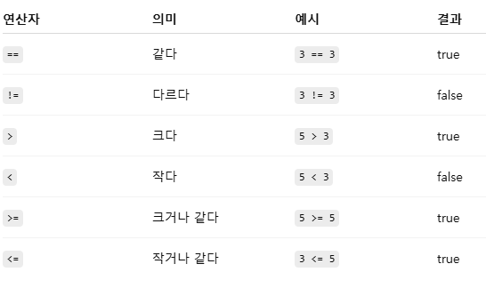

# 용어정리
## javac 
 Java Compiler (자바 컴파일러 - .java 소스 파일을 컴파일해서 .class 바이트코드 파일을 만드는 명령어)

## method
클래스 안에 정의된 동작(기능). 객체가 할 수 있는 “동사(행동)”를 코드로 작성

## Path 환경 변수
운영체제(OS) 가 프로그램 실행 파일을 찾는 검색 경로

## 예약어
Java 언어에서 이미 특정 의미/용도로 정해진 단어 (class, public, static, void, int, if, else, for, while 등)

## 이스케이프 문자
문자 그대로 쓰면 의미가 달라지는 특수문자나, 출력하기 힘든 제어문자를 표현하기 위한 약속된 기호

## char
자바(Java)에서 문자 하나를 저장하는 **기본 타입(primitive type)**이에요. 그런데 사실 단순히 "문자"만 저장하는 게 아니라 유니코드(Unicode) 코드값을 저장

## String.format
문자열을 만들 때 **특정 형식(format)**을 지정하고, 그 안에 변수 값을 끼워 넣어주는 기능

## 참조 타입 (Reference type)
- 객체(object)나 배열(array) 같은 주소(reference) 를 저장
- 실제 데이터는 힙(heap) 메모리에 있고, 변수에는 그 주소가 들어감
- null 가능 (값이 없음을 의미)
- 클래스, 인터페이스, 배열, 열거(enum) 등 모두 참조 타입

- 기본 타입은 실제 값을 직접 들고 다니는 "원시 데이터"
- 참조 타입은 "힙에 있는 객체/배열을 가리키는 주소"

## 형식 문자열
- 출력할 때 값을 원하는 형식(Format) 으로 바꿔서 보여주도록 하는 문자열

## 캐스트(cast)
- 타입을 바꿔 쓰겠다고 컴파일러에 명시하는 것
- 기본형 캐스트 (숫자 타입들)
  - 넓히기(widening): 정보 손실 없음 → 자동  
    (int → long → float → double 등)
  - 좁히기(narrowing): 값 잘릴 수 있음 → 명시적 캐스트 필요
  - 연산 승격 주의: byte/short/char는 연산에 들어가면 int로 승격
- 참조형(객체) 캐스트
  - 상속/인터페이스 관계가 있을 때만 가능
  - 업캐스트(upcast): 자식 → 부모 (안전, 자동)
  - 다운캐스트(downcast): 부모 → 자식 (위험, 런타임 검사 필요)

  ## 문자열 비교
- 문자열 : String(문자의 불변(immutable) 시퀀스. 한 번 만들면 내용이 바뀌지 않음)
- 내용 비교는 항상 equals / equalsIgnoreCase.
- null 가능 변수 비교는 "리터럴".equals(var) 또는 Objects.equals(a,b).
- 반복 연결은 StringBuilder 사용.

## 연산자
- 산술 연산자 : 수학 계산을 할 때 사용  

- 대입 연산자 : 값을 변수에 넣을 때 사용  

- 비교 연산자 : 두 값을 비교할 때 사용 → 결과는 true / false  
  

- 논리 연산자 : 조건식 여러 개를 묶을 때 사용  

- 증감 연산자 : 값을 1씩 증가/감소  
 

- 비트 연산자 : 비트를 직접 다룰 때  

## 삼항 연산자  
- 기본 형태 : 조건식 ? 값1 : 값2  
  - 조건식 → true 또는 false로 평가되는 식  
    값1 → 조건이 참일 때 선택되는 값  
    값2 → 조건이 거짓일 때 선택되는 값

## 반복문
  

## 조건문
- 특정 조건이 참(true)일 때만 코드가 실행되도록 하는 문법

## boolean
- 참(true) / 거짓(false) 두 값만 가질 수 있는 논리형 데이터 타입

------
## 생성자 
- 생성자(Constructor)는 클래스의 객체(인스턴스)가 생성될 때 자동으로 호출되는 특수한 메서드
- 특징 :
  - 클래스 이름과 동일한 이름을 가져야 한다.  
  - 리턴 타입이 없다 (void도 쓰지 않음).  
  - 객체를 만들 때 new 키워드와 함께 호출  
  - 여러 개를 만들면 생성자 오버로딩(overloading)이 가능

## 인스턴스 필드 (instance field)
- 클래스 안에 선언된 변수. 각 객체(인스턴스)마다 독립적으로 존재하는 변수
- 객체가 생성될 때(new로 만들 때) 힙(heap) 메모리에 따로 저장
- 서로 다른 객체는 서로 다른 값을 가진다.

## 정적 필드 (static field)
- 클래스 변수(Class Variable) 라고도 부름.
- static 키워드를 붙여 선언한 필드.
- 클래스 로드 시점에 단 한 번 생성. 모든 인스턴스(객체)가 값을 공유
- 객체를 만들지 않아도 클래스명.필드명 으로 접근 가능.

## 인스턴스 필드와 정적 필드의 차이  

## 패키지 (package)
- 클래스들을 묶어서 관리하는 폴더(디렉터리) 개념  
- 클래스 파일들을 정리하는 폴더이자 이름공간(namespace) → 이름 충돌 방지 + 코드 관리 + 접근제어 용이

## 접근 제한자 (Access Modifier)
- 자바 접근 제한자 종류  

## 접근자(accessor)
- 클래스의 필드(멤버 변수)에 안전하게 접근하기 위한 메서드  
- Getter(읽기용 - 필드 값을 외부에서 읽어올 때 사용.)와 Setter(쓰기용 - 필드 값을 외부에서 변경할 때 사용.)로 나뉘며, 이 둘을 묶어 프로퍼티 접근 메서드