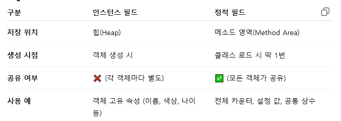
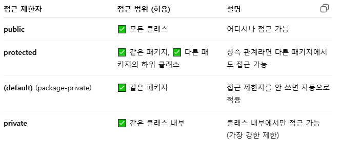

# 용어정리 2

## 힙(Heap)
- JVM(Java Virtual Machine) 메모리에서 객체(Instance)가 저장되는 영역  
- new 키워드로 생성한 모든 객체와 배열이 여기 저장
- 모든 스레드(Thread)가 공유하는 메모리 영역  
- 동적 메모리 할당(Dynamic Allocation) : 프로그램 실행 중에 객체가 필요할 때마다 new 로 만들고 힙에 저장.

## 인덱스(index)
- 배열, 문자열, 리스트 등에서 데이터의 "위치"를 나타내는 번호 (0부터 시작 → 첫 번째 요소는 인덱스 0, 두 번째는 인덱스 1, 마지막 인덱스 = length - 1)

## Integer.parseInt
- 자바에서 문자열을 정수(int) 로 변환할 때 사용하는 정적 메서드

## Integer.MIN_VALUE
- 최댓값 구하기에 활용 (Integer.MAX_VALUE는 최솟값 구하기)
- 자바에서 int 타입이 가질 수 있는 가장 작은 값을 의미하는 상수
- 왜 MIN_VALUE로 초기화하나?  
→ 어떤 값이 들어와도 첫 번째 비교에서 무조건 갱신되도록 하기 위해
(만약 0으로 시작하면, 모든 값이 0보다 작을 때 max가 잘못 남을 수 있음)

## 생성자 
- 생성자(Constructor)는 클래스의 객체(인스턴스)가 생성될 때 자동으로 호출되는 특수한 메서드
- 특징 :
  - 클래스 이름과 동일한 이름을 가져야 한다.  
  - 리턴 타입이 없다 (void도 쓰지 않음).  
  - 객체를 만들 때 new 키워드와 함께 호출  
  - 여러 개를 만들면 생성자 오버로딩(overloading)이 가능

## void
- 메서드의 반환(return) 타입을 나타낼 때 쓰는 키워드
  ```
  class Printer {
    // 반환값 없음 → 그냥 출력만 하는 메서드
    void printHello() {
        System.out.println("안녕하세요!");
    }

    // 반환값 있는 메서드 (참고)
    String getHello() {
        return "안녕하세요!";
    }
  }


## 인스턴스 필드 (instance field)
- 클래스 안에 선언된 변수. 각 객체(인스턴스)마다 독립적으로 존재하는 변수
- 객체가 생성될 때(new로 만들 때) 힙(heap) 메모리에 따로 저장
- 서로 다른 객체는 서로 다른 값을 가진다.

## 정적 필드 (static field)
- 클래스 변수(Class Variable) 라고도 부름.
- static 키워드를 붙여 선언한 필드.
- 클래스 로드 시점에 단 한 번 생성. 모든 인스턴스(객체)가 값을 공유
- 객체를 만들지 않아도 클래스명.필드명 으로 접근 가능.

## 인스턴스 필드와 정적 필드의 차이  


## 패키지 (package)
- 클래스들을 묶어서 관리하는 폴더(디렉터리) 개념  
- 클래스 파일들을 정리하는 폴더이자 이름공간(namespace) → 이름 충돌 방지 + 코드 관리 + 접근제어 용이

## 접근 제한자 (Access Modifier)
- 자바 접근 제한자 종류  


## 접근자(accessor)
- 클래스의 필드(멤버 변수)에 안전하게 접근하기 위한 메서드  
- Getter(읽기용 - 필드 값을 외부에서 읽어올 때 사용.)와 Setter(쓰기용 - 필드 값을 외부에서 변경할 때 사용.)로 나뉘며, 이 둘을 묶어 프로퍼티 접근 메서드