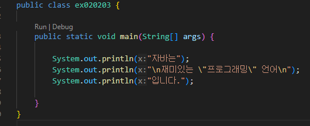
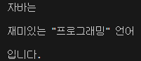
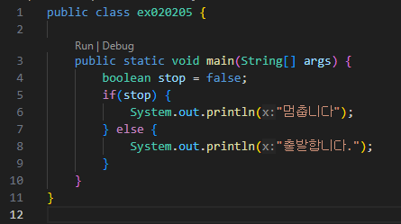
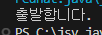

# 혼공자 확인 문제 1~4

### [용어정리 1](https://github.com/jinseonyeong087-ship-it/java-study/blob/main/Terminology.md)

### 01-01-01

- 소스파일은 사람이 읽을 수 있는 프로그래밍 언어로 작성된 파일. 컴파일러가 해석해야하는 텍스트
- 자바 언어로 프로그램을 개발하기 위해서는 JDK(Java Development Kit)를 설치
- JDK가 설치되면 기본적으로 C:\Program Files\Java 폴더가 생성 (Windows에서 기본 설치 경로는 C:\Program Files\Java\jdk버전)
- 자바 컴파일러와 실행 명령어는 JDK 설치폴더 \bin 폴더에 있다.

### 01-01-02
- 다른 경로에서 bin 폴더 안에 있는 명령어를 사용할 수 있도록 하기 위해 JDK 설치 폴더 안의 bin 폴더를 Path 환경 변수에 등록해야 한다.

### 01-02-01
- 이클립스는 무료이며, 통합 개발 환경(IDE)을 제공한다.
- 이클립스를 실행할 때에는 워크스페이스를 지정해야 한다.
- 퍼스펙티브는 뷰들을 미리 묶어 이름을 붙여 놓은 것이다.

### 01-03-01
- 자바 프로그램 개발 과정 순서
1. 소스파일(~.java)을 작성
2. javac 명령어로 컴파일
3. java 명령어로 실행
4. 실행결과 확인

### 01-03-02
- 자바 소스는?
  - 컴파일하면 '클래스이름.class'라는 바이트 코드 파일이 생성
  - main() 메소드는 반드시 클래스 블록 내부에서 작성
  - 컴파일 후 실행을 하려면 반드시 main() 메소드가 있어야 한다.

### 01-03-03
- 주석?
  - //뒤의 라인 내용은 모두 주석이 된다.
  - /*부터 시작해서 */까지 모든 내용이 주석이 된다.
  - 문자열 안에는 주석을 만들 수 없다.

### 01-03-04
- 이클립스의 자바 프로젝트?
  - 기본적으로 소스 파일과 바이트 코드 파일이 저장되는 폴더가 다르다.
  - 자바 소스 파일을 작성하는 폴더는 src이다.
  - 올바르게 작성된 소스 파일을 저장하면 자동으로 컴파일되고, 바이트 코드 파일이 생성된다.

### 01-03-05
- 이클립스에서 바이트 코드 파일을 실행하는 방법?
  - Package Explorer 뷰에서 소스 파일을 선택하고, 툴 바에서 Run 아이콘을 클릭
  - Package Explorer 뷰에서 소스 파일을 선택하고, 마우스 오른쪽 버튼을 클릭한 후 [Run As] - [Java Application]을 선택

### 02-01-01
- 변수?
  - 변수는 하나의 값만 저장
  - 변수는 선언 시에 사용한 타입의 값만 저장
  - 변수는 변수가 선언된 중괄호 {} 안에서만 사용 가능

### 02-01-02
- 변수 이름 가능 : 첫 글자가 문자, $, _ (첫 글자가 문자더라도 예약어는 사용 불가 - class, public, static, void, int 등)

### 02-01-03
- [컴파일 에러 찾기](https://github.com/jinseonyeong087-ship-it/java-study/blob/main/src/java/example/ex020103.java)  
int sum;  
int score = 0;  
int score2;  
sum = score1 + score2; ----->error : 위에서 score2에 대한 결과값(초기화)를 하지 않아 컴파일 에러 발생

### 02-01-04
- [컴파일 에러 찾기](https://github.com/jinseonyeong087-ship-it/java-study/blob/main/src/java/example/ex020104.java)    
int v1 = 0;  
if (true) {  
  int v2 = 0;  
  if (true) {  
    int v3 = 0;  
    v1 = 1;  
    v2 = 1;  
    v3 = 1;  
  }  
  v1 = v2 + v3;     ------->error : 지역 변수 v3는 안쪽 if 블록에서만 유효  
}  
System.out.println(v1);

### 02-02-01
- 자바의 기본 타입  

### 02-02-02
- 변수에 값을 저장하는 코드  
  -char var = 65;  
  -double var = 100.0;

### 02-02-03
- [코드실행](https://github.com/jinseonyeong087-ship-it/java-study/blob/main/src/java/example/ex020203.java)  
  

### 02-02-04
- 컴파일 에러 발생  
double value = 2e-350;   ------->error : 허용범위를 벗어남(double이 허용하는 소수점 이하 자리는 15자리 정도)

### 02-02-05
- [코드실행](https://github.com/jinseonyeong087-ship-it/java-study/blob/main/src/java/example/ex020205.java)  
  

### 02-03-01
- 기본 타입 자동 변환 허용 범위 (크기 순서)
  - byte (1바이트, -128 ~ 127)
  - short (2바이트, -32,768 ~ 32,767)
  - char (2바이트, 0 ~ 65,535, 부호 없음)
  - int (4바이트, 약 -21억 ~ 21억)
  - long (8바이트, 매우 큰 정수 범위)
  - float (4바이트, 부동소수점, 정밀도 약 7자리)
  - double (8바이트, 부동소수점, 정밀도 약 15자리)

- 변환 가능 경로  
byte → short, char → int → long → float → double  

**주의**   
char와 short는 크기(2바이트)는 같지만 표현 방식이 달라서 바로 변환 불가. char → int → long → float → double로는 자동 변환이 가능

### 02-03-02
- 강제 타입 변환

- String 은 기본 타입(primitive type) 이 아니고, 참조 타입(reference type, 클래스).자동/강제 변환이 안 됨. valueOf(), parseXXX() 같은 메소드로 변환

### 02-03-03
- 연산식에서의 타입 변환  
  - 자바의 산술 연산 규칙 : (자바는 산술 연산(+,-,*,/ 등) 을 할 때, 피연산자가 int 보다 작은 타입이면 자동으로 int로 변환) byte, short, char → 연산 시 int로 변환. byte + byte 결과는 int 타입

### 02-03-04
- [컴파일 에러 찾기](https://github.com/jinseonyeong087-ship-it/java-study/blob/main/src/java/example/ex020304.java)  
short s1 = 1;  
short s2 = 2;  
int i1 = 3;  
int i2 = 4;  
short result = s1 + s2;   ------> error : short는 연산시 int로 변환  
int result = il + i2;     ------> 위에서 int로 변환시 변수 중복 선언이 되어 얘도 변경

### 02-03-05
- [컴파일 에러 찾기](https://github.com/jinseonyeong087-ship-it/java-study/blob/main/src/java/example/ex020305.java)  
char c1 = 'a';  
char c2 = c1 + 1;         ------->error : char는 연산시 int로 변환  
System.out.println(c2);  

### 02-03-06
- [연산](https://github.com/jinseonyeong087-ship-it/java-study/blob/main/src/java/example/ex020306.java)  
int x = 5;  
int y = 2;  
int result = x / y;  
System.out.println(result);    
출력 결과 : 2

### 02-03-07
- [연산](https://github.com/jinseonyeong087-ship-it/java-study/blob/main/src/java/example/ex020307.java)  
int x = 5;  
int y = 2;  
double result = (int)x / (double)y;  
System.out.println(result);  
출력 결과 : 2.5

### 02-03-08
- [연산](https://github.com/jinseonyeong087-ship-it/java-study/blob/main/src/java/example/ex020308.java)  
double var1 = 3.5;  
double var2 = 2.7;  
int result = (int)(var1 + var2);  
출력 결과 : 6 

### 02-03-09
- [연산](https://github.com/jinseonyeong087-ship-it/java-study/blob/main/src/java/example/ex020309.java)   
long var1 = 2L;  
float var2 = 1.8f;  
double var3 = 2.5;  
String var4 = "3.9";  
int result = (int)(var1 + var2 + var3) + (int)Double.parseDouble(var4);  
System.out.println(result);   
출력 결과 : 9

정수 형태 문자열 → Integer.parseInt, Long.parseLong, Short.parseShort 등  
소수점 포함 문자열 → Double.parseDouble, Float.parseFloat 등

### 02-03-10
- [코드실행](https://github.com/jinseonyeong087-ship-it/java-study/blob/main/src/java/example/ex020310.java)  
String str1 = 2 + 3 + "";  
String str2 = 2 + "" + 3;  
String str3 = "" + 2 + 3;  

System.out.println(str1);  
System.out.println(str2);  
System.out.println(str3);  

출력 결과 : 5, 23, 23  

숫자 + 숫자 → 덧셈    
문자열 + (숫자든 뭐든) → 문자열 결합

### 02-03-11
- [타입변환](https://github.com/jinseonyeong087-ship-it/java-study/blob/main/src/java/example/ex020311.java)   
byte value1 = Byte.parseByte("10");  
int value2 = Integer.parseInt("1000");  
float value3 = Float.parseFloat("20.5");  
double value4 = Double.parseDouble("3.14159");  
- 문자열을 기본 타입으로 변환. 변환 시 변수 중복 선언으로 인한 에러로 변수 변경

### 02-04-01
- [코드작성](https://github.com/jinseonyeong087-ship-it/java-study/blob/main/src/java/example/ex020401.java)  
String name = "김자바";  
int age = 25;  
String tel1 ="010", tel2 = "123", tel3 = "4567";  
System.out.println("이름: " + name);  
System.out.print("나이: " + age);  
System.out.printf("\n전화: %s-%s-%s", tel1, tel2, tel3);  

-  형식 문자열을 사용한다면 System.out.printf 사용

### 02-04-02
- [코드작성](https://github.com/jinseonyeong087-ship-it/java-study/blob/main/src/java/example/ex020402.java)  
Scanner scanner = new Scanner(System.in);  
System.out.print("첫 번째 수: ");  
String strNum1 = scanner.nextLine();  
System.out.print("두 번째 수: ");  
String strNum2 = scanner.nextLine();  
int num1 = Integer.parseInt(strNum1);  
int num2 = Integer.parseInt(strNum2);  
int result = num1 + num2;  
System.out.println("덧셈 결과: " + result);  

- 숫자로 계산하려면 Integer.parseInt 로 문자열 → int 변환

### 02-04-03
- [코드작성](https://github.com/jinseonyeong087-ship-it/java-study/blob/main/src/java/example/ex020403.java)  

### 03-01-01
- 연산자와 연산식
  - 연산자는 피연산자의 수에 따라 단항, 이항, 삼항 연산자로 구분
  - 비교 연산자와 논리 연산자의 산출 타이븐 boolean(true/false)타입
  - 하나의 값이 올 수 있는 자리라면 연산식도 올 수 있음
  - 연산식은 항상 단 하나의 값을 산출

### 03-01-02
- 연산의 방향과 연산 우선순위에 대한 설명
  - 산술 연산(+,-,*,/)은 연산 방향이 왼쪽에서 오른쪽으로 수행
  - 대입 연산(=.+=)은 연산 방향이 오른쪽에서 왼쪽으로 수행
  - 우선순위와 관계없이 먼저 연산을 하고 싶다면 괄호()로 묶기
  - 산술(+, -, , /, %) > 비교(<, <=, >, >=, ==, !=) > 논리(&&, ||) > 대입(=) 순으로 우선시 됨. 산술이 먼저 계산되고 그 결과를 비교·논리에서 사용

### 03-02-01
- [컴파일에러](https://github.com/jinseonyeong087-ship-it/java-study/blob/main/src/java/example/ex030201.java)  
byte b = 5;  
b = -b;     --------->error : -(단항 음수) 연산은 정수 승격이 일어나서 byte 값이 int로 바뀜. 오른쪽은 int이고, 왼쪽은 byte → 좁히는 변환이라서 캐스트가 없으면 컴파일 오류  
int result = 10 / b;  
System.out.println(result);  

### 03-02-02
- [코드실행](https://github.com/jinseonyeong087-ship-it/java-study/blob/main/src/java/example/ex030202.java)  
int x = 10;  
int y = 20;  
int z = (++x) + (y--);  
System.out.println(z);  
출력결과 : 31 

### 03-02-03
- [코드실행](https://github.com/jinseonyeong087-ship-it/java-study/blob/main/src/java/example/ex030203.java)  
boolean stop = false;  
while (!stop) {  
System.out.println("stop");  
stop = true;}  

### 03-02-04
- [코드작성](https://github.com/jinseonyeong087-ship-it/java-study/blob/main/src/java/example/ex030204.java)  
int pencils = 534;
int student = 30;

//학생 1명이 가지는 연필 개수  
int pencilsPerStudent = (pencils / student);  
System.out.println(pencilsPerStudent);  

//남은 연필 개수  
int pencilsLeft = (pencils % student);  
System.out.println(pencilsLeft);  

### 03-02-05
- [출력값오류](https://github.com/jinseonyeong087-ship-it/java-study/blob/main/src/java/example/ex030205.java)  
int var1 = 5;  
int var2 = 2;  
double var3 = var1 / var2;  
int var4 = (int) (var3 * var2);  
System.out.println(var4);  
출력결과 : 4
- var1과 var2가 둘 다 정수형이어서 var1 / var2는 정수.  
  수정하려면 var1 또는 var2를 더블로 형변환하여 소수점 값을 계산

### 03-02-06
- [코드작성](https://github.com/jinseonyeong087-ship-it/java-study/blob/main/src/java/example/ex030206.java)  
int value = 356;  
System.out.println((value/100)*100);  
출력결과 : 300

### 03-02-07
- [출력값오류](https://github.com/jinseonyeong087-ship-it/java-study/blob/main/src/java/example/ex030207.java)  
public static void main(String[] args) {  
float var1 = 10f;  
float var2 = var1 / 100;  
if(var2 == 0.1) {  
System.out.println("10%입니다.");  
} else {  
System.out.println("10%가 아닙니다.");}  
}
출력결과 : 10%가 아닙니다.
- if (var2 == 0.1f)로 같은 타입끼리 비교해야 10%입니다.의 출력 결과가 나옴.

### 03-02-08
- [코드작성](https://github.com/jinseonyeong087-ship-it/java-study/blob/main/src/java/example/ex030208.java)   
int lengthTop = 5;  
int lengBottom = 10;  
int height = 7;  
double area = ((double)(lengthTop+lengBottom)*height)/2;  
System.out.println(area);   

### 03-02-09
- [코드작성](https://github.com/jinseonyeong087-ship-it/java-study/blob/main/src/java/example/ex030209.java)  
  

### 03-02-10
- [코드수정](https://github.com/jinseonyeong087-ship-it/java-study/blob/main/src/java/example/ex030210.java)  
int var1 = 10;  
int var2 = 3;  
int var3 = 14;  
double var4 = var1 * var1 * var2 + "." + var3;  
System.out.println("원의 넓이: " + var4);  

- 수정후  

### 03-02-11
- [코드작성](https://github.com/jinseonyeong087-ship-it/java-study/blob/main/src/java/example/ex030211.java)  
   
  

### 03-02-12
- [출력결과](https://github.com/jinseonyeong087-ship-it/java-study/blob/main/src/java/example/ex030212.java)  
int x = 10;  
int y = 5;  
System.out.println((x>7) && (y<=5));  
System.out.println((x%3 == 2) || (y%2 != 1));  
출력결과 : true , false

- &&는 논리 AND 연산자 : 조건1 && 조건2 → 두 조건이 모두 참(true) 일 때만 전체 결과가 참
- ||는 논리 OR 연산자 : 조건1 || 조건2 → 두 조건 중 하나라도 참(true) 이면 전체 결과가 참

### 03-02-13
- [실행문변경](https://github.com/jinseonyeong087-ship-it/java-study/blob/main/src/java/example/ex030213.java)   
int value = 0;  
value = value + 10; ------> value += 10;  
value = value - 10; ------> value -= 10;  
value = value * 10; ------> value *= 10;  
value = value / 10; ------> value /= 10;  

### 03-02-14
- [출력결과](https://github.com/jinseonyeong087-ship-it/java-study/blob/main/src/java/example/ex030214.java)  
int score = 85;  
String result = (!(score>90)) ? "가" : "나";  
System.out.println(result);  
출력 결과 : 가
- 점수가 90점보다 크지 않으면 true"  
  !(score > 90)이 true면 "가"를 선택  
  !(score > 90)이 false면 "나"를 선택

### 04-01-01
- 조건문의 종류 : if문, switch문

### 04-01-02
- if문
  - if문은 조건식의 결과에 따라 실행 흐름을 달리할 수 있음.
  - if문은 조건식이 true이면 블록을 실행하고 false이면 블록을 실행하지 않는다.
  - if문의 블록 내부에는 또 다른 if문을 사용할 수 있다.

### 04-01-03
- [출력결과](https://github.com/jinseonyeong087-ship-it/java-study/blob/main/src/java/example/ex040103.java)  
  
출력 결과 : 등급은 B 입니다.

### 04-01-04
- [출력결과](https://github.com/jinseonyeong087-ship-it/java-study/blob/main/src/java/example/ex040104.java)  
  
출력 결과 :  
어떤 혜택을 원하세요?  
우수 회원 혜택을 받으실 수 있습니다.  
일반 회원 혜택을 받으실 수 있습니다.  
감사합니다.  
- break가 없음으로 인해 두개의 값 출력

### 04-02-01
- 반복문의 종류 : for문, while문, do-while문

### 04-02-02
- [코드작성](https://github.com/jinseonyeong087-ship-it/java-study/blob/main/src/java/example/ex040202.java)  

### 04-02-03
- [코드작성](https://github.com/jinseonyeong087-ship-it/java-study/blob/main/src/java/example/ex040203.java)  

### 04-02-04
- [코드작성](https://github.com/jinseonyeong087-ship-it/java-study/blob/main/src/java/example/ex040204.java)  

- for문은 반드시 3개의 식 for (초기식; 조건식; 증감식) 아니면 에러.

### 04-02-05
- [코드작성](https://github.com/jinseonyeong087-ship-it/java-study/blob/main/src/java/example/ex040205.java)  
  
출력 결과  
 

### 04-02-06
- [코드작성](https://github.com/jinseonyeong087-ship-it/java-study/blob/main/src/java/example/ex040206.java)  
  
출력 결과  

  
### 04-02-07
- [코드작성](https://github.com/jinseonyeong087-ship-it/java-study/blob/main/src/java/example/ex040207.java)  

### [혼공자2](https://github.com/jinseonyeong087-ship-it/java-study/blob/main/Readme2.md)  