# 혼공자 9~14

## [용어정리 3](https://github.com/jinseonyeong087-ship-it/java-study/blob/main/%EC%9A%A9%EC%96%B4%EC%A0%95%EB%A6%AC3.md)  

## 09-01-01
- 중첩 멤버 클래스란?
  - 클래스의 멤버(필드, 메서드)처럼 선언된 클래스
    바깥 클래스의 인스턴스에 종속되는 인스턴스 멤버 클래스를 말함
    즉, 클래스 안에 클래스를 두는데, static이 붙지 않은 경우

- 특징
  - 바깥 클래스의 필드, 메서드에 자유롭게 접근 가능
  - 특히 private 멤버도 접근 가능  

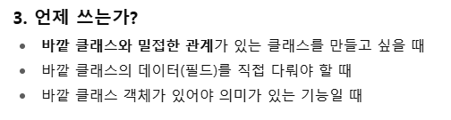  
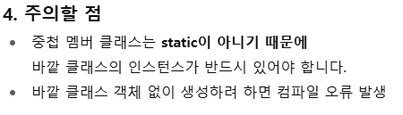  
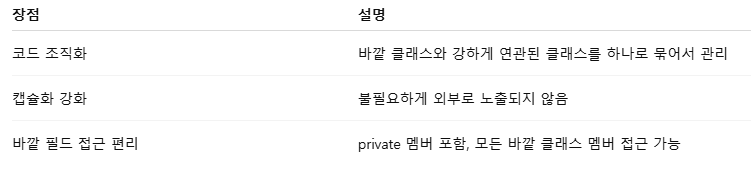   
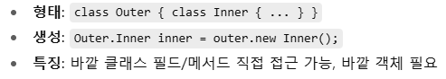  

## 09-01-02
- 로컬 클래스란?
  - 메서드 내부에 선언된 클래스  
    즉, 클래스가 메서드 안에서만 쓰이고, 해당 메서드 실행 중에만 유효한 클래스

- 특징
```
-스코프가 메서드 내부로 제한

로컬 클래스는 선언된 메서드 안에서만 보이고, 밖에서는 사용할 수 없음

- 바깥 클래스 멤버 접근 가능

바깥 클래스의 필드, 메서드에 자유롭게 접근 가능
메서드의 final 또는 effectively final 지역 변수에도 접근 가능
```
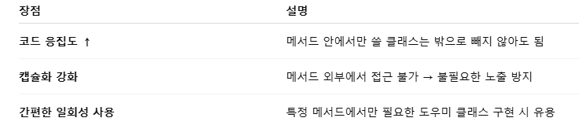  

- 주의할 점
  - 로컬 클래스는 메서드가 호출될 때만 메모리에 로드됨
  - 메서드가 끝나면 로컬 클래스 객체도 사라짐
  - 지역 변수에 접근할 때는 반드시 수정되지 않는 값이어야 함 (effectively final)

## 09-01-03
- Car.java  
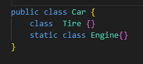
- NestedClassExample  
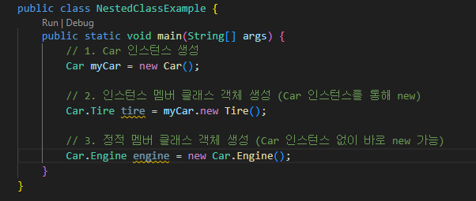


## 09-01-04
- [컴파일오류](https://github.com/jinseonyeong087-ship-it/java-study/blob/main/src/java/example/Chatting.java)  
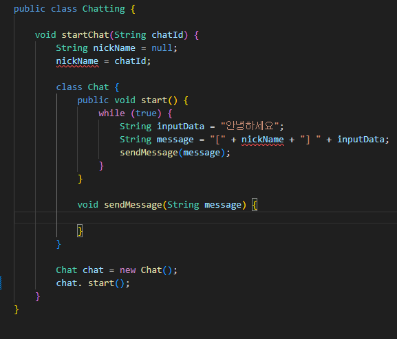  

- 기존 코드 컴파일 오류 원인
```
String nickName = null; → 1차 대입,
nickName = chatId; → 2차 대입.
두 번 대입이라 effectively final이 아님 → 로컬 클래스에서 참조 불가.
```

- effectively final이란?  
final을 안 붙여도 값을 한 번만 대입해서 이후 변경이 없으면 컴파일러가 final처럼 취급

## 09-01-05
- CheckBox class  
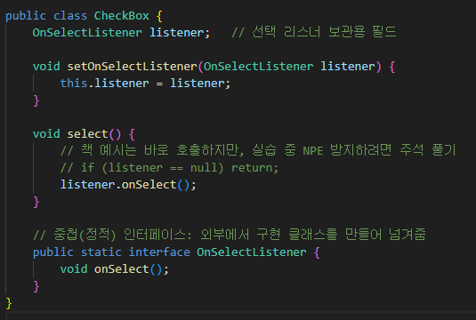  

- BackgroundChangeListener class  
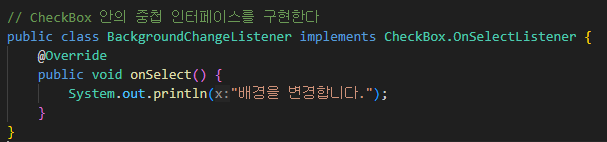  

- CheckBoxExample class    
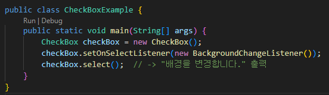


## 09-02-01
- 인터페이스 [Worker.java](https://github.com/jinseonyeong087-ship-it/java-study/blob/main/src2/java/exam01/Worker.java)  
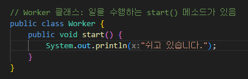  

- 익명 구현 클래스와 객체 생성 [Anonymous.java](https://github.com/jinseonyeong087-ship-it/java-study/blob/main/src2/java/exam01/Anonymous.java)  
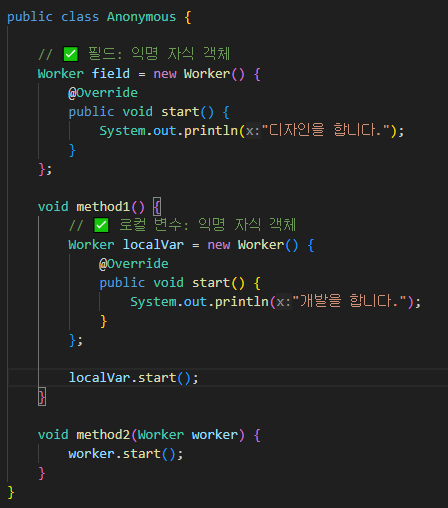  

- 익명 구현 클래스와 객체 생성 [AnonymousExample.java](https://github.com/jinseonyeong087-ship-it/java-study/blob/main/src2/java/exam01/AnonymousExample.java)   
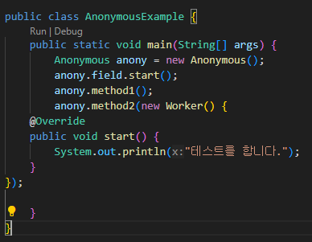  

**빌드 & 런(build & run)**
```
javac -encoding UTF-8 -d bin src2\java\exam01\*.java   
java -cp bin src2.java.exam01.AnonymousExample
```

## 09-02-02
- 인터페이스 [Vehicle.java](https://github.com/jinseonyeong087-ship-it/java-study/blob/main/src2/java/exam02/Vehicle.java)  
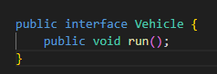  

- 익명 구현 클래스와 객체 생성 [Anonymous.java](https://github.com/jinseonyeong087-ship-it/java-study/blob/main/src2/java/exam02/Anonymous.java)  
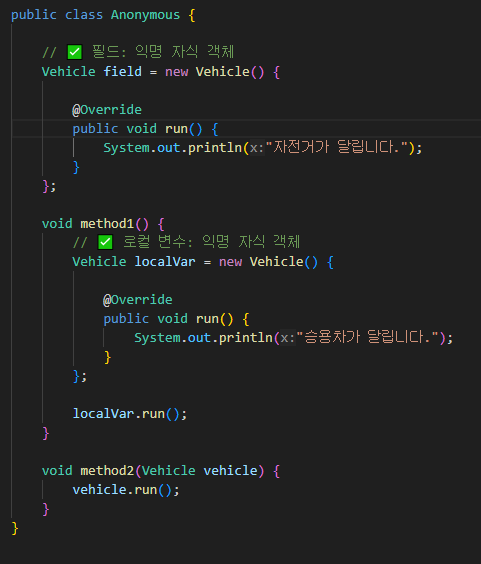  

- 익명 구현 클래스와 객체 생성 [AnonymousExample.java](https://github.com/jinseonyeong087-ship-it/java-study/blob/main/src2/java/exam02/AnonymousExample.java)  
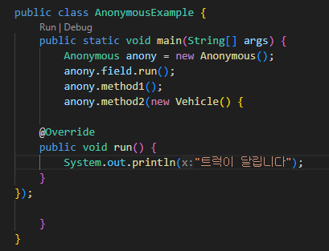  

**빌드 & 런(build & run)**
```
javac -encoding UTF-8 -d bin src2\java\exam02\*.java   
java -cp bin src2.java.exam02.AnonymousExample
```

## 09-02-03
- 인터페이스 [CheckBox.java]()  
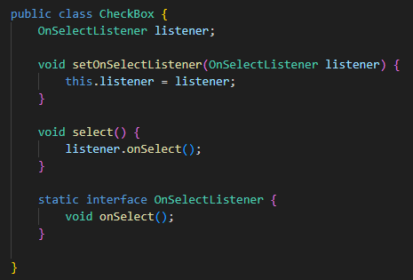  

- 익명 구현 클래스와 객채 생성 []()  
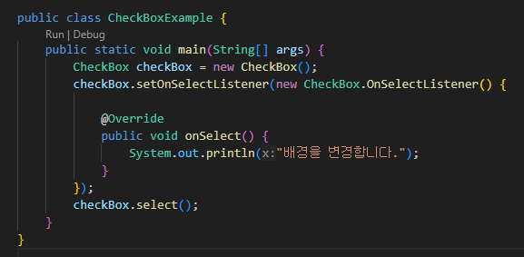  

**빌드 & 런(build & run)**
```
javac -encoding UTF-8 -d bin src2\java\exam03\*.java   
java -cp bin src2.java.exam03.CheckBoxExample
```

## 10-01-01
- 예외(Exception)
```
프로그램 실행 중 정상적이지 않은 상황(오류)이 발생했을 때 알리는 객체 

RuntimeException의 하위 클래스는 컴파일러가 예외 처리 코드를 체크하지 않는다.

예외는 클래스로 관리 

예외가 발생하면 JVM은 해당 메서드 실행을 중단하고, 예외 처리 코드(try-catch-finally)나 호출자에게 예외를 던집니다.  
즉, 예외는 실행 도중에 생기는 “비정상 사건”을 나타내는 객체
```

- 오류(Error)와 예외(Exception)의 차이
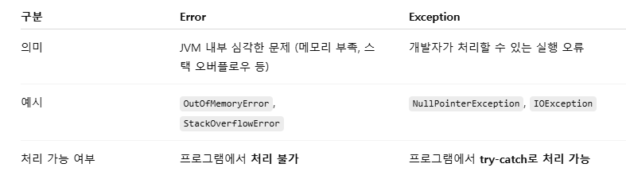

## 10-02-01
**try-catch-finally 블록**
- 예외(에러)가 발생했을 때 프로그램이 중단되지 않고 안전하게 처리할 수 있도록 해주는 구문  
  Java, C#, Python(try-except-finally) 등 대부분의 언어에서 지원  
```
1. try 블록
- 예외가 발생할 가능성이 있는 코드를 넣는 부분
- 예외가 발생하면 즉시 catch로 이동하고, 남은 try 코드는 실행되지 않습니다.

2. catch 블록
- try에서 발생한 예외를 잡아 처리하는 부분입니다.
- 여러 개의 catch를 작성할 수 있으며, 예외 타입별로 다른 처리 가능.
- Exception을 마지막에 두어 예상하지 못한 모든 예외를 처리하는 것이 일반적입니다.

3. finally 블록
- 무조건 실행됩니다. (예외가 발생해도, return으로 메서드를 빠져나가도 실행)
- 주로 리소스 해제(파일 닫기, DB 연결 해제 등)에 사용
```
- 실행 순서
```
1. try 블록 실행 → 예외 발생 시점에서 중단

2.발생한 예외와 일치하는 catch 블록 실행

3. 마지막에 finally 블록 실행

4. 예외가 없으면 catch는 건너뛰고 finally만 실행
```
**finally에서 자원 해제 코드를 작성하면 예외 발생 여부와 관계없이 안전하게 정리 가능**

## 10-02-02
**throws**
- try-catch-finally와는 달리 "예외를 직접 처리하지 않고 호출한 쪽으로 넘기는 역할"
- 생성자나 메소드의 선언 끝 부분에 사용되어 내부에서 발생된 예외를 떠넘긴다.
- throws 뒤에는 떠넘겨야 할 예외를 쉼표(,)로 구분해서 기술
- 모든 예외를 떠넘기기 위해 간단하게 throws Exception으로 작성할 수 있다.

## 10-02-03
**예외처리**
```
public void method1() throws NumberFormatException, ClassNotFoundException {...}
```
①
```
try {
    method1();
} catch (Exception e) {
}

catch(Exception e)
Exception은 ClassNotFoundException도 포함.
NumberFormatException은 RuntimeException이라 안 잡아도 되고, 잡으면 문제 없음.
✅ 올바른 예외 처리.
```

②
```
void method2() throws Exception {
    method1();
}

hrows Exception
method2()도 throws Exception으로 선언했으니 ClassNotFoundException도 호출자에게 던질 수 있음.
NumberFormatException은 runtime 예외라 throws 안 적어도 됨.
✅ 문법적으로 문제 없음.
```

③
```
try {
    method1();
} catch (ClassNotFoundException e) {
} catch (NumberFormatException e) {
}

개별 catch

ClassNotFoundException 먼저, 그다음 NumberFormatException.

상속 관계 문제 없음. (서로 관련 없는 예외 타입)
✅ 올바른 예외 처리.
```
## 10-02-04
- [TryCatchFinallyExample](https://github.com/jinseonyeong087-ship-it/java-study/blob/main/src2/java/TryCatchFinallyExample.java)  

**출력 결과**
```
10
숫자로 변환할 수 없음
10
인덱스를 초과했음
10

*설명
i=0 → "10" → 정상 파싱 → value=10 → finally 출력 → 10

i=1 → "2a" → NumberFormatException 발생 → catch 출력 → 숫자로 변환할 수 없음 → finally 출력 → 10 (value 유지)

i=2 → 배열 범위 초과 → ArrayIndexOutOfBoundsException 발생 → catch 출력 → 인덱스를 초과했음 → finally 출력 → 10
```

## 11-01-01
```
모든 자바 클래스의 최상위 부모 클래스이다.
Object 의 equals() 메소드는 == 연산자와 동일하게 번지를 비교한다.
동등 비교를 위해 equals()와 hashCode() 메소드를 재정의하는 것이 좋다.
```
- Object 클래스
  - 자바에서 모든 클래스는 java.lang.Object를 상속
  - 명시적으로 extends를 안 써도 자동으로 상속
  - 모든 클래스는 Object의 메소드를 사용할 수 있음
  
  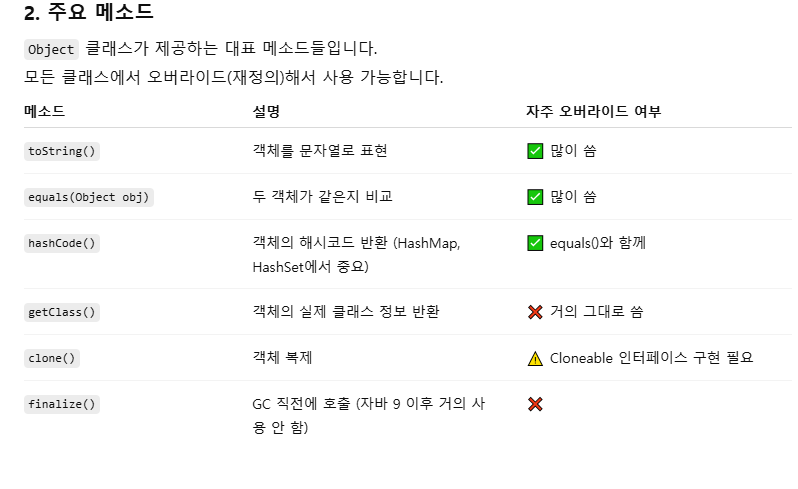
  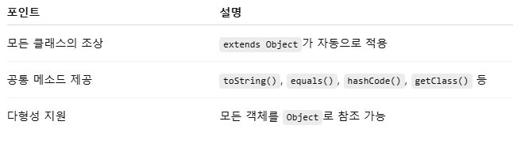

## 11-01-02
- Object의 equals()와 hashCode() 메소드를 재정의 했을 때 메소드 호출 순서
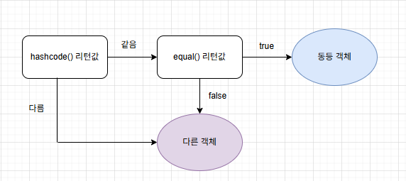

## 11-01-03
- [Student.java](https://github.com/jinseonyeong087-ship-it/java-study/blob/main/src2/java/Student.java)  
- [StudentExample.java](https://github.com/jinseonyeong087-ship-it/java-study/blob/main/src2/java/StudentExample.java)  

**동작 원리**
```
equals()는 두 Student 객체의 studentNum 값이 같으면 true 반환.

hashCode()도 studentNum 기반으로 계산되기 때문에 HashMap, HashSet에서 같은 객체로 취급됨.

따라서 new Student("1")로 put()한 후, new Student("1")로 get()하면 동일 키로 인식해서 "95" 값이 나옴.
```

## 11-01-04
- [Member.java](https://github.com/jinseonyeong087-ship-it/java-study/blob/main/src2/java/Member.java)  
- [MemberExample.java](https://github.com/jinseonyeong087-ship-it/java-study/blob/main/src2/java/MemberExample.java)  

**동작 원리**
```
System.out.println(member); → 내부적으로 member.toString() 호출

우리가 toString()을 재정의했으므로 "blue: 이파란" 문자열이 출력됨

만약 toString()을 재정의하지 않았다면 Member@6bc7c054 같은 해시코드 문자열이 나왔을 것임
```

## 11-01-05

**클래스(Class)와 객체(Object)의 관계**  
클래스(Class) = 설계도  

객체(Object) = 설계도를 바탕으로 만든 실제 인스턴스  

**클래스 객체(Class Object)**
```
자바에서 클래스도 하나의 객체
즉, 클래스 자체의 정보(이름, 필드, 메소드 등)를 담고 있는 메타데이터 객체가 존재하고, 이걸 Class 타입으로 다룰 수 있다.

Class.forName() 메소드 또는 객체의 getClass() 메소드로 얻을 수 있다.

클래스의 생성자, 필드, 메소드에 대한 정보를 알아낼 수 있다.

클래스 파일을 기준으로 상대 경로의 리소스의 정보를 얻을 수 있다.
```

- 특징  
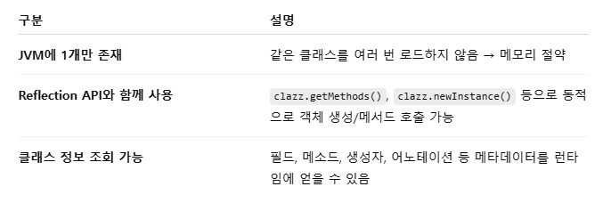

## 11-01-06
- [BytesToStringExample]()  

**출력 결과**
```
I love you

- 설명
바이트 값 = 문자 코드 값(숫자) 이고
String 생성 시 JVM이 그 숫자들을 문자로 매핑해서 문자열을 만드는 거예요.
```

## 11-01-07
- [FindAndReplaceExample.java](https://github.com/jinseonyeong087-ship-it/java-study/blob/main/src2/java/FindAndReplaceExample.java)  

**출력 결과**
```
자바 문자열이 포함되어 있습니다.
-->모든 프로그램은 Java 언어로 개발될 수 있다.


-설명
indexOf("자바") → "자바"가 있는 위치 인덱스 반환 (없으면 -1)

replace("자바", "Java") → 문자열에서 "자바" 부분만 "Java"로 치환

원본 문자열 str을 새 문자열로 덮어쓰고 다시 출력
```

## 11-01-08
- [IntegerCompareExample.java]() 

**출력 결과**
```
true
false
```
**결과 이유**
```
1. Integer 캐싱 (Integer Cache)
Java에서 Integer는 -128 ~ 127 범위의 값을 미리 캐싱해 둡니다.
Integer obj1 = 100; → 오토박싱 시 Integer.valueOf(100) 호출
valueOf()는 -128~127 범위면 같은 객체를 반환 → 동일 참조
따라서 obj1 == obj2 → true

2. 300은 캐싱 범위 밖
Integer obj3 = 300; → Integer.valueOf(300) 호출
300은 캐싱 범위가 아니므로 새로운 객체 생성
obj3와 obj4는 값은 같지만 서로 다른 객체 참조
obj3 == obj4 → false (주소가 다름)
```

**값 자체를 비교하려면 equals() 사용**

## 11-01-09
- [StringConverExample.java](https://github.com/jinseonyeong087-ship-it/java-study/blob/main/src2/java/StringConverExample.java)  

**문자열->정수, 정수->문자열**
```
- Integer.parseInt(strData1)

문자열 "200"을 정수 200으로 변환
반환 타입은 int
잘못된 숫자 문자열이면 NumberFormatException 발생

- String.valueOf(intData2)

정수 150을 문자열 "150"으로 변환
오버로딩 메서드라 int, double, boolean 등 어떤 타입이든 문자열로 바꿔줌
```

## 11-02-01
- [TodayDateExample.java]()  


## 11-02-02
